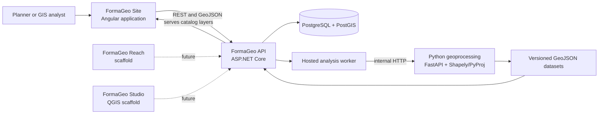

# FormaGeo application overview

## Purpose

FormaGeo is a geospatial site-intelligence platform for screening candidate
locations, understanding contextual constraints, and comparing sites with
repeatable suitability models. The repository is organized as a suite:

- **FormaGeo Site** is the implemented web application for projects, site
  boundaries, contextual maps, spatial analysis, and suitability scoring.
- **FormaGeo Reach** is reserved for accessibility and service-coverage
  analysis. It is currently an Angular starter application.
- **FormaGeo Studio** is reserved for QGIS integration. It currently contains
  only the QGIS plugin lifecycle skeleton.

The current end-to-end product is therefore FormaGeo Site together with the
ASP.NET Core API, PostGIS database, and Python geoprocessing service.

## Current implementation status

| Area | Status | Notes |
| --- | --- | --- |
| FormaGeo Site | Implemented | Project and site management, map editing, GeoJSON import/export, analyses, and scoring |
| Shared map experience | Implemented | MapLibre maps, drawing/editing, contextual overlays, legends, filtering, opacity, and feature identification |
| ASP.NET Core API | Implemented | REST API, application services, domain rules, persistence, static layer delivery, and an in-process analysis worker |
| PostgreSQL/PostGIS | Implemented | Entity Framework Core migrations, spatial storage, measurements, indexes, and development seed data |
| Python geoprocessing | Implemented | Versioned analysis engine exposed through FastAPI |
| FormaGeo Reach | Scaffold only | No product routes or accessibility workflow yet |
| FormaGeo Studio | Scaffold only | No menus, tools, processing provider, or synchronization behavior yet |
| Authentication and authorization | Not implemented | The API and frontend currently assume a trusted local environment |
| Production infrastructure | Not implemented | Deployment, reverse-proxy, GeoServer, and environment folders are placeholders |

## System context



The browser owns interaction and visualization. The API owns business rules,
durable records, and orchestration. PostGIS stores site geometry and performs
authoritative site measurements. Python performs dataset-backed spatial
analysis in an appropriate local UTM projection.

## Core concepts

### Project

A project is the top-level workspace. It groups candidate sites, saved map
layer preferences, and suitability-scoring scenarios. The project list shows
the number of sites in each project.

### Site

A site is a named polygon in WGS 84 (`EPSG:4326`) belonging to one project.
Sites can be created by drawing on the map or importing GeoJSON. A site can be
renamed, have its boundary replaced, be archived and restored, be exported as
GeoJSON, or be permanently deleted.

### Contextual layer

A contextual layer is a catalog entry with source attribution, version,
delivery method, display style, and legend. Each project saves visibility,
opacity, order, and a text filter for the layers it uses. The current
development catalog contains illustrative boundaries, planning, hazards,
environment, transport, and facilities layers.

### Analysis run

An analysis run is a durable, versioned request against a saved site. It moves
through `Pending`, `Running`, and a terminal state of `Completed`, `Failed`, or
`Cancelled`. Results retain metrics, explanation, source versions, limitations,
and optional GeoJSON evidence.

### Scoring scenario and model

A scoring scenario is the user-facing comparison setup within a project. Every
save creates a new immutable model version containing criteria, thresholds,
weights, normalization rules, and missing-data behavior. A scoring result
points to the exact model that produced it and stores its full breakdown.

## Main user journeys

### 1. Create and open a project

The default route is `/projects`. A user can create a named project and open
its workspace. In development, the API can automatically create the
**Metro Manila Site Feasibility Study (Demo)** project with five sample sites
and enabled contextual layers.

### 2. Create or import sites

Inside `/projects/:projectId`, a user can:

- draw a polygon on the map and save it as a new site;
- import a `.geojson` or `.json` file up to 1 MB;
- preview and select Polygon or MultiPolygon features before import;
- import polygons as separate sites or merge compatible polygons into one;
- use WGS 84 data directly or transform declared Web Mercator input;
- choose a target project and apply a naming pattern;
- review invalid, repaired, skipped, unselected, or duplicate features.

Both the browser and backend validate imports. The backend is authoritative and
performs topology validation, safe repair during import, duplicate detection,
and persistence.

### 3. Inspect and manage a site

Selecting a site opens an inspector alongside the map. The user can review:

- geometry type, coordinate system, validity, rings, and vertices;
- geodesic area and perimeter;
- centroid and bounding box;
- data-quality warnings for invalid, complex, or unusually wide geometry;
- lifecycle state and analysis history.

The map supports site selection, visibility toggles, drawing, vertex editing,
deletion, three base-map choices, and automatic fitting. Unsaved boundary edits
are protected by navigation and browser-unload warnings.

### 4. Explore contextual data

The layer panel groups overlays by category. Users can change visibility,
opacity, drawing order, and filters; view legends and source information; and
identify rendered features. Project-layer preferences are saved automatically
after changes.

The API currently serves demonstration GeoJSON files from
`backend/src/FormaGeo.Api/wwwroot/layers`. They are synthetic workflow data,
not authoritative planning or hazard data.

### 5. Run spatial analyses

The analysis catalog currently provides:

| Analysis | Primary output |
| --- | --- |
| Site Geometry | Area, perimeter, centroid, bounds, rings, and vertices |
| Hazard Exposure | Flood, landslide, storm-surge, protected-area, and fault-proximity evidence |
| Zoning | Land use, jurisdiction, development restrictions, and unzoned area |
| Terrain | Elevation, slope, steep-area estimate, and coverage |
| Accessibility | Distance to the nearest mapped transport corridor |
| Nearby Facilities | Facilities within a radius and their distances |
| Suitability | A compact analysis-engine score using contextual datasets |

The UI can queue the three core intelligence analyses—Hazard Exposure, Zoning,
and Terrain—in one action or request any catalog analysis separately. It polls
the API every two seconds while work is pending or running. Completed evidence
can be toggled on the map and downloaded as GeoJSON.

Analysis findings are explanatory rather than permitting decisions. Core
findings include severity, classification, affected area and percentage,
methodology, source metadata, dataset version, limitations, and result
geometry.

### 6. Build and run suitability scoring

From `/sites/:siteId/scoring`, a user can:

- start from balanced, resilience-first, or community-access presets;
- add or remove criteria;
- set weights, direction, normalization, thresholds, and missing-data rules;
- save new scenarios or create immutable versions of existing scenarios;
- duplicate a scenario;
- compare up to 50 sites from the same project;
- inspect rankings, strengths, weaknesses, missing information, and the
  criterion-level calculation breakdown.

This scoring workflow is separate from the Python engine's compact
`Suitability` analysis. The scoring workspace uses saved and versioned backend
models and obtains raw values from the latest completed analyses for each site.

## Technology and repository layout

| Path | Responsibility |
| --- | --- |
| `frontend/` | Angular 22 and Nx workspace containing Site, Reach, and shared libraries |
| `backend/` | .NET 10 solution containing API, Application, Domain, and Infrastructure projects |
| `geoprocessing/` | Python 3.11+ FastAPI service and versioned spatial-analysis engine |
| `database/` | PostGIS bootstrap SQL and placeholders for database assets |
| `qgis-plugin/` | FormaGeo Studio QGIS plugin skeleton |
| `contracts/` | Example JSON and placeholders for shared schemas/OpenAPI artifacts |
| `docs/` | Architecture, development, and system documentation |
| `data/` | Local raw and processed data locations excluded from source control |
| `infrastructure/` | Placeholder directories for deployment and service configuration |

Notable frontend libraries include:

- `shared/api-client` for typed HTTP services;
- `shared/models` for client-side API contracts;
- `shared/map` for MapLibre rendering and interaction;
- `shared/ui` for reusable status, metric, alert, and empty-state components;
- `shared/design-tokens` for themes and visual tokens.

The `shared/authentication` and `shared/geospatial` libraries are currently
generated placeholders.

## Local development

### Prerequisites

- Docker with Compose
- .NET 10 SDK
- Node.js and npm
- Python 3.11 or newer

### 1. Start PostGIS

From the repository root:

```bash
cp .env.example .env
docker compose up -d postgis
```

The default database is available on `localhost:5433`.

### 2. Start the Python geoprocessing service

```bash
cd geoprocessing
python3 -m venv .venv
.venv/bin/pip install -e '.[dev]'
.venv/bin/formageo-geoprocessing
```

The service listens on `http://localhost:8000`. By default it discovers the
demonstration datasets in the API project. Set `FORMAGEO_DATASET_DIR` to use a
different dataset directory.

### 3. Start the API

The runtime requires a `ConnectionStrings:Database` value. It can be supplied
through a local, ignored `appsettings.Development.json` or an environment
variable:

```bash
cd backend
ConnectionStrings__Database='Host=localhost;Port=5433;Database=formageo;Username=formageo;Password=formageo_dev' \
  dotnet run --project src/FormaGeo.Api
```

The API listens on `http://localhost:5055`. In Development, the checked-in
settings apply pending migrations and seed the demonstration project by
default. OpenAPI JSON is available at `/openapi/v1.json` and Swagger UI at
`/swagger`.

### 4. Start FormaGeo Site

```bash
cd frontend
npm ci
npx nx serve site
```

Open `http://localhost:4200`. The current frontend API base URL is compiled as
`http://localhost:5055`.

### Useful health checks

- API: `GET http://localhost:5055/health`
- Python: `GET http://localhost:8000/health`

## Testing

```bash
dotnet test backend/FormaGeo.slnx
geoprocessing/.venv/bin/pytest geoprocessing
cd frontend && npx nx run-many -t test
```

The repository contains .NET unit, integration, and architecture test projects;
Python analysis-engine tests; Angular component and library tests; and
Playwright application scaffolds. Nx's current `test` targets cover Reach and
the registered shared libraries. FormaGeo Site contains spec files but does not
currently register a `test` target, so the command above does not execute its
specs.

## Operational and product limitations

- There is no authentication, authorization, tenant isolation, or audit actor.
- CORS allows only the local frontend origins configured in the API.
- Dataset files and the seeded project are synthetic demonstrations.
- The analysis queue is a database table polled by a worker inside the API
  process; it is not an external durable job system.
- The API, database, Python service, and frontend are not assembled into a
  production deployment in this repository.
- The frontend API URL and API CORS origins are local-development values.
- Only GeoJSON Polygon and MultiPolygon import is supported; persisted sites
  are individual Polygon geometries in WGS 84.
- Project deletion, user management, collaboration, and permissions are not
  implemented.
- Reach, Studio, authentication, several infrastructure directories, and the
  generated weather endpoint remain scaffolding.

For backend implementation details, see
[Backend low-level reference](./backend-low-level.md).
