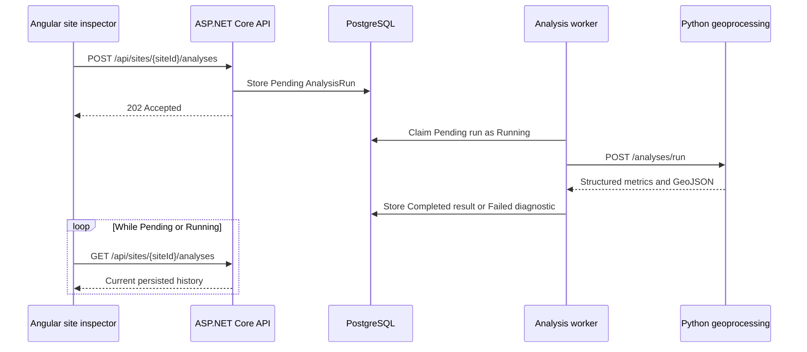

# Analysis engine and intelligence results

Phase 20 introduces a durable, versioned analysis lifecycle around saved
sites. The browser never waits for a spatial operation to finish in the
request that creates it.

Phase 21 builds on that lifecycle with evidence-rich hazard, planning, and
terrain intelligence. Results are explanatory rather than pass/fail: each
finding identifies what was calculated, the affected geometry and area, the
source dataset and version, and the limitations that affect interpretation.



## Lifecycle

`AnalysisRun` records the site, analysis type, input parameters, status,
result, diagnostic error, lifecycle dates, and analysis version. Supported
statuses are `Pending`, `Running`, `Completed`, `Failed`, and `Cancelled`.
Running records are returned to `Pending` when the API worker restarts, so an
interrupted process does not strand a request.

The initial worker is hosted in the API process and calls the Python service
over internal HTTP. The repository and processor boundaries allow the worker
to move to an external job queue later without changing the public API or
frontend polling model.

## Endpoints

- `GET /api/analyses/catalog`
- `POST /api/sites/{siteId}/analyses`
- `GET /api/analyses/{analysisId}`
- `GET /api/sites/{siteId}/analyses`
- `DELETE /api/analyses/{analysisId}` to cancel a Pending or Running run

## Local services

Apply the Entity Framework migrations, then run the Python service before the
API:

```bash
cd geoprocessing
.venv/bin/pip install -e '.[dev]'
.venv/bin/formageo-geoprocessing
```

The API defaults to `http://localhost:8000/` and supports configuration through
`Geoprocessing:BaseUrl`. Dataset discovery defaults to the API's demonstration
GeoJSON directory and can be overridden with `FORMAGEO_DATASET_DIR`.

## Analysis version 2.0.0

The catalog includes Site Geometry, Hazard Exposure, Zoning, Terrain,
Accessibility, Nearby Facilities, and Suitability. Python validates the site
geometry and parameters, loads only the datasets needed for the selected
operation, and performs measurements in a local UTM projection.

The three core Phase 21 categories return:

- Hazard Exposure: flood-zone intersection, fault-line proximity, landslide
  exposure, storm-surge exposure, and protected-area overlap.
- Zoning and Planning: zoning classification, land-use classification,
  administrative jurisdiction, and development restrictions.
- Terrain: minimum, maximum, and average elevation; average slope; and steep
  area and percentage.

Every core-category result contains an `evidence` collection. Each evidence
item has a summary, severity and classification, intersection area, percentage
of the site, result geometry, calculation methodology, source metadata, data
version, and limitations. The top-level result also contains combined geometry,
aggregate metrics, and the distinct source records used by the analysis.

Result geometry is GeoJSON and can be displayed independently from the site
boundary. Area and percentage values are computed after projecting the site
and source features into the site's local UTM coordinate reference system.
Fault-line proximity is reported as a distance-based classification because a
line need not intersect the site to be relevant.

## Data limitations

The GeoJSON files committed under
`backend/src/FormaGeo.Api/wwwroot/layers` are synthetic demonstration datasets.
They exercise the complete data and UI flow but are not authoritative inputs
for permitting, engineering, emergency response, insurance, or investment
decisions. Production deployments must replace them with current authoritative
datasets and preserve each publisher, version, publication date, coordinate
reference system, license, source URL, methodology, and known limitations.
