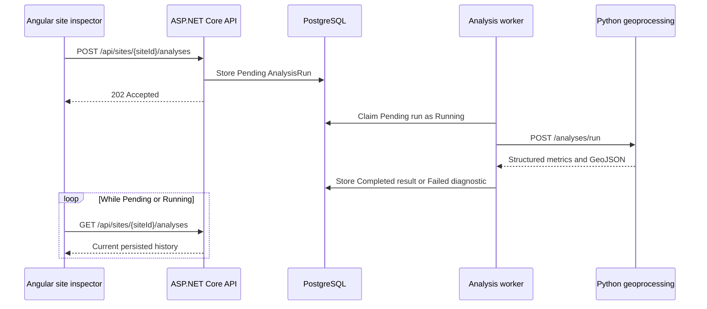

# Analysis engine foundation

Phase 20 introduces a durable, versioned analysis lifecycle around saved
sites. The browser never waits for a spatial operation to finish in the
request that creates it.



## Lifecycle

`AnalysisRun` records the site, analysis type, input parameters, status,
result, diagnostic error, lifecycle dates, and analysis version. Supported
statuses are `Pending`, `Running`, `Completed`, `Failed`, and `Cancelled`.
Running records are returned to `Pending` when the API worker restarts, so an
interrupted process does not strand a request.

The initial worker is hosted in the API process and calls the Python service
over internal HTTP. The repository and processor boundaries allow the worker
to move to an external job queue later without changing the public API or
frontend polling model.

## Endpoints

- `GET /api/analyses/catalog`
- `POST /api/sites/{siteId}/analyses`
- `GET /api/analyses/{analysisId}`
- `GET /api/sites/{siteId}/analyses`
- `DELETE /api/analyses/{analysisId}` to cancel a Pending or Running run

## Local services

Apply the Entity Framework migrations, then run the Python service before the
API:

```bash
cd geoprocessing
.venv/bin/pip install -e '.[dev]'
.venv/bin/formageo-geoprocessing
```

The API defaults to `http://localhost:8000/` and supports configuration through
`Geoprocessing:BaseUrl`. Dataset discovery defaults to the API's demonstration
GeoJSON directory and can be overridden with `FORMAGEO_DATASET_DIR`.

## Analysis version 1.0.0

The first catalog includes Site Geometry, Hazard Exposure, Zoning,
Accessibility, Nearby Facilities, and Suitability. Python validates the site
geometry and parameters, loads only the datasets needed for the selected
operation, performs measurements in a local UTM projection, and returns a
stable JSON envelope with a summary, metrics, and result geometry when the
operation produces one.
