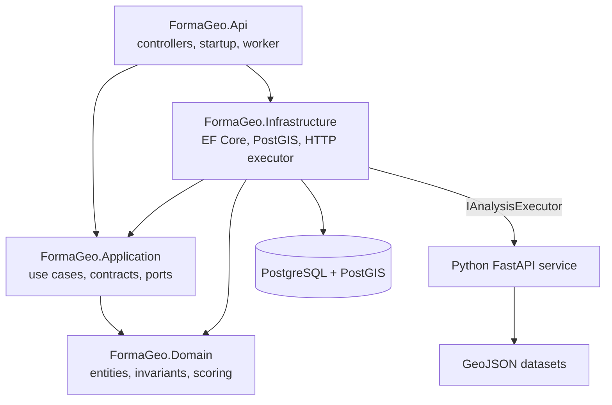
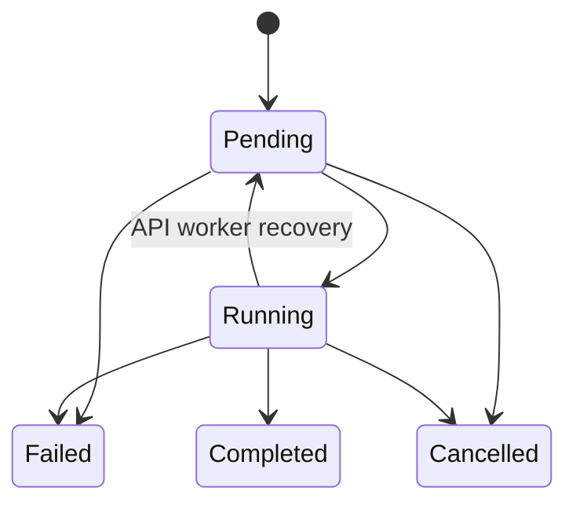
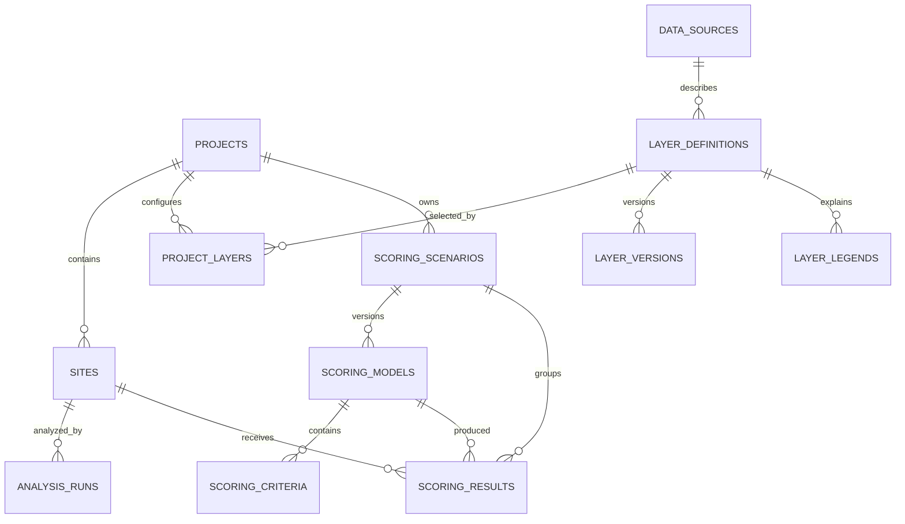
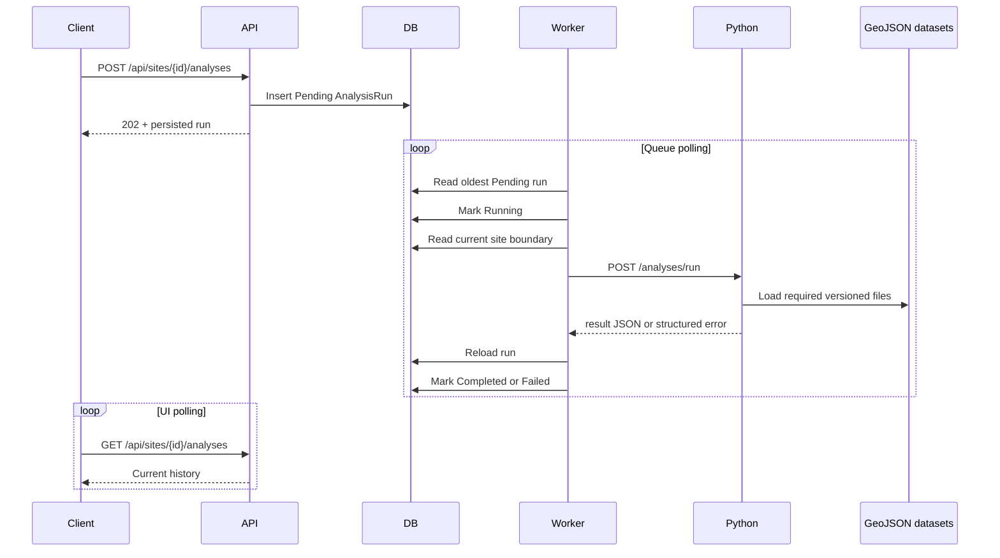

# FormaGeo backend low-level reference

## Scope

This document describes the implemented backend formed by:

- the .NET 10 ASP.NET Core API under `backend/`;
- the PostgreSQL/PostGIS persistence layer;
- the hosted analysis worker in the API process;
- the Python 3.11+ FastAPI geoprocessing service under `geoprocessing/`.

The public web application is documented at a higher level in
[FormaGeo application overview](./application-overview.md).

## Architecture and dependency direction

The .NET solution follows a layered architecture:



| Project | Responsibility |
| --- | --- |
| `FormaGeo.Domain` | Domain entities, state transitions, invariants, enums, and pure suitability calculation |
| `FormaGeo.Application` | Request/response contracts, handlers, catalogs, orchestration services, repository interfaces, and geometry mapping |
| `FormaGeo.Infrastructure` | EF Core DbContext/configuration, repository implementations, PostGIS query, seeding, analysis processing, and Python HTTP client |
| `FormaGeo.Api` | HTTP controllers, dependency registration, JSON/error behavior, CORS, static files, OpenAPI, and hosted worker |

The API and application layers depend on abstractions such as
`IProjectRepository`, `ISiteRepository`, `IAnalysisRunRepository`,
`ILayerCatalogRepository`, `IScoringRepository`, `ISiteSummaryReader`, and
`IAnalysisExecutor`. Infrastructure supplies the concrete implementations.

## Process startup and configuration

`FormaGeo.Api/Program.cs` performs the following:

1. Limits Kestrel request bodies to 1,200,000 bytes.
2. Registers MVC controllers and serializes enums as strings.
3. Replaces the default model-state response with a compact JSON error.
4. Registers OpenAPI and all application/infrastructure services.
5. Adds an `AnalysisWorker` hosted service.
6. Allows CORS from `http://localhost:4200` and
   `http://127.0.0.1:4200`.
7. In Development, optionally applies migrations and seeds mock data.
8. In Development, exposes OpenAPI and Swagger UI.
9. Serves `wwwroot`, including `.geojson` as `application/geo+json`.
10. Converts Kestrel `413` responses into JSON.

### Configuration keys

| Key | Required | Default | Purpose |
| --- | --- | --- | --- |
| `ConnectionStrings:Database` | Yes | None at runtime | Npgsql connection string |
| `Geoprocessing:BaseUrl` | No | `http://localhost:8000/` | Internal Python service URL |
| `Geoprocessing:PollingIntervalSeconds` | No | `2`, minimum `1` | Empty-queue delay for the hosted worker |
| `DatabaseInitialization:ApplyMigrations` | No | `true` in checked-in settings | Apply EF migrations on Development startup |
| `DatabaseInitialization:SeedMockData` | No | `true` in checked-in settings | Seed development project and layer preferences |
| `FORMAGEO_DATASET_DIR` | No | API `wwwroot/layers` directory | Python dataset discovery override |

The design-time EF factory contains the default local PostGIS connection on
port `5433`, but the API runtime still requires an explicit connection string.

## Dependency injection lifetimes

EF Core's `FormaGeoDbContext`, repositories, readers, handlers, application
services, `AnalysisRunProcessor`, and the mock-data seeder are scoped.
`GeoprocessingAnalysisExecutor` is registered as a singleton and owns one
`HttpClient` with a five-minute timeout. `AnalysisWorker` is a singleton hosted
service that creates a fresh asynchronous scope for each queue inspection.

## HTTP API

All request and response properties use the default web JSON naming policy
(`camelCase`). Enums are serialized as their string names.

### Health and development scaffold

| Method | Route | Success | Behavior |
| --- | --- | --- | --- |
| `GET` | `/health` | `200` | API health, service name, and UTC timestamp |
| `GET` | `/WeatherForecast` | `200` | Generated ASP.NET starter endpoint; not part of the FormaGeo domain |

The Python service separately exposes `GET /health`.

### Projects

| Method | Route | Success | Main failure cases |
| --- | --- | --- | --- |
| `POST` | `/api/projects` | `201` | `400` invalid name |
| `GET` | `/api/projects` | `200` | — |
| `GET` | `/api/projects/{projectId}` | `200` | `404` missing project |

Create body:

```json
{
  "name": "Metro Manila candidate sites"
}
```

Project responses contain `id`, `name`, `createdAtUtc`, and `siteCount`.
Projects are returned newest first. The site count includes sites of every
status.

### Sites and imports

| Method | Route | Success | Main failure cases |
| --- | --- | --- | --- |
| `POST` | `/api/projects/{projectId}/sites` | `201` | `400` name/geometry, `404` project |
| `GET` | `/api/projects/{projectId}/sites` | `200` | `404` project |
| `POST` | `/api/projects/{projectId}/site-imports` | `200` | `400` import, `404` project, `413` size |
| `GET` | `/api/sites/{siteId}` | `200` | `404` |
| `GET` | `/api/sites/{siteId}/summary` | `200` | `404` |
| `GET` | `/api/sites/{siteId}/export?format=geojson` | `200` | `400` format, `404` |
| `PATCH` | `/api/sites/{siteId}` | `200` | `400` name, `404` |
| `PUT` | `/api/sites/{siteId}/boundary` | `200` | `400` geometry, `404` |
| `POST` | `/api/sites/{siteId}/archive` | `200` | `404` |
| `POST` | `/api/sites/{siteId}/restore` | `200` | `404` |
| `DELETE` | `/api/sites/{siteId}` | `204` | `404` |

A direct create request uses an RFC 7946-style Polygon:

```json
{
  "name": "Candidate A",
  "boundary": {
    "type": "Polygon",
    "coordinates": [
      [
        [121.03, 14.65],
        [121.04, 14.65],
        [121.04, 14.66],
        [121.03, 14.65]
      ]
    ]
  }
}
```

The import endpoint consumes `multipart/form-data`:

| Field | Type | Meaning |
| --- | --- | --- |
| `file` | File | Required `.geojson` or `.json`, maximum 1 MiB |
| `namePattern` | String | Supports `{feature}` and `{n}` placeholders |
| `mode` | `Separate` or `Merge` | Create one site per polygon or union into one polygon |
| `selectedFeatureIndexes` | Repeated integer | Optional zero-based feature selection |

Import accepts a GeoJSON FeatureCollection, Feature, Polygon, or MultiPolygon.
It recognizes declared `EPSG:4326`/`CRS84` and
`EPSG:3857`/`EPSG:900913`. Web Mercator coordinates are transformed to WGS 84.
MultiPolygons become multiple sites in `Separate` mode. `Merge` succeeds only
when union produces one valid Polygon. Topologically equal geometry already in
the project, or accepted earlier in the same import, is skipped.

The result reports a generated import ID, detected coordinate system, input
feature counts, imported sites, skipped features, and warnings. The import ID
is informational and is not persisted as its own entity.

### Contextual layers

| Method | Route | Success | Main failure cases |
| --- | --- | --- | --- |
| `GET` | `/api/layers` | `200` | — |
| `GET` | `/api/layers/{layerId}` | `200` | `404` |
| `GET` | `/api/layers/{layerId}/legend` | `200` | `404` |
| `GET` | `/api/projects/{projectId}/layers` | `200` | `404` project |
| `PUT` | `/api/projects/{projectId}/layers` | `200` | `400` invalid preference, `404` project/layer |

The update endpoint replaces the entire saved preference set in one database
transaction. Duplicate layer IDs are rejected. Opacity must be between `0` and
`1`, order must be non-negative, and a normalized filter may not exceed 200
characters.

Catalog responses expose the current layer version only. They include display
style JSON, source/license metadata, delivery method and URL, coverage, CRS,
geometry type, feature-name property, and optional zoom/source-layer metadata.

The backend catalog categories are `Boundaries`, `Planning`, `Hazards`,
`Environment`, `Transport`, and `Facilities`. Terrain analysis overlays are
constructed from result geometry in the frontend and are not persisted catalog
layers.

### Analysis runs

| Method | Route | Success | Main failure cases |
| --- | --- | --- | --- |
| `GET` | `/api/analyses/catalog` | `200` | — |
| `POST` | `/api/sites/{siteId}/analyses` | `202` | `400` validation, `404` site |
| `GET` | `/api/analyses/{analysisId}` | `200` | `404` |
| `GET` | `/api/sites/{siteId}/analyses` | `200` | `404` site |
| `DELETE` | `/api/analyses/{analysisId}` | `204` | `404`, `409` terminal run |

Create body:

```json
{
  "analysisType": "HazardExposure",
  "inputParameters": {
    "minimumOverlapPercent": 0,
    "faultSearchDistanceMetres": 5000
  }
}
```

Creating an analysis validates and fills default parameters, creates a
`Pending` record, and returns immediately with `202 Accepted`. Site history is
ordered by request time descending.

Supported state transitions are:



Cancellation changes database state. It does not abort a Python request already
in progress; after the request returns, the processor reloads the record and
discards the result unless the state is still `Running`.

### Suitability scoring

| Method | Route | Success | Main failure cases |
| --- | --- | --- | --- |
| `GET` | `/api/scoring/catalog` | `200` | — |
| `GET` | `/api/projects/{projectId}/scoring-scenarios` | `200` | `404` project |
| `GET` | `/api/scoring-scenarios/{scenarioId}` | `200` | `404` |
| `POST` | `/api/projects/{projectId}/scoring-scenarios` | `201` | `400` validation, `404` project |
| `PUT` | `/api/scoring-scenarios/{scenarioId}` | `200` | `400` validation, `404` |
| `POST` | `/api/scoring-scenarios/{scenarioId}/duplicate` | `201` | `404` |
| `POST` | `/api/scoring-scenarios/{scenarioId}/score` | `200` | `400` validation, `404` |
| `GET` | `/api/scoring-scenarios/{scenarioId}/results` | `200` | `404` |

Scenario create and update bodies contain a name and criteria. Every update
inserts a new model with `latestVersion + 1`; previous models and results remain
unchanged. Duplicate creates a new scenario and model version `1`.

Run body:

```json
{
  "siteIds": [
    "00000000-0000-0000-0000-000000000000"
  ],
  "modelVersion": 2
}
```

At least one and at most 50 site IDs are allowed. Duplicate IDs are removed.
Every site must belong to the scenario's project. Omitting `modelVersion` uses
the latest version. The result query returns at most the newest 250 stored
results.

## Domain model and invariants

### Project

- ID is generated with `Guid.NewGuid()`.
- Name is trimmed, required, and limited to 200 characters.
- Creation time is UTC.

### Site

- Project ID must be non-empty.
- Name is trimmed, required, and limited to 200 characters.
- Boundary must be a non-empty valid NetTopologySuite `Polygon`.
- Boundary SRID is set to `4326`.
- New sites are `Active`; the `Draft` enum value is not currently produced.
- Rename and boundary update change `UpdatedAtUtc`.
- Archive is idempotent and sets `ArchivedAtUtc`.
- Restore is idempotent and clears `ArchivedAtUtc`.
- Permanent deletion cascades to dependent analysis and scoring records.

Archive restrictions are primarily enforced by the frontend. Backend analysis
creation does not currently reject an archived site.

### GeoJSON boundary validation

`GeoJsonPolygonMapper` enforces:

- type exactly `Polygon`;
- optional SRID exactly `4326`;
- one or more rings;
- no more than 10,000 coordinate positions;
- at least four positions per ring;
- exactly two finite numbers per position;
- longitude in `[-180, 180]` and latitude in `[-90, 90]`;
- first and last position of every ring must match;
- valid non-empty polygon topology.

Direct create/update rejects invalid topology. Import may use
NetTopologySuite's `GeometryFixer`; a repaired Polygon or MultiPolygon is
accepted only if every resulting polygon is non-empty and valid.

### AnalysisRun

- Inputs and outputs are validated JSON strings and stored as `jsonb`.
- The analysis version is required and limited to 50 characters in storage.
- Invalid lifecycle transitions throw.
- Failures store a diagnostic of at most 2,000 characters.
- Terminal runs cannot be cancelled.

### ProjectLayer

- Composite identity is `(ProjectId, LayerDefinitionId)`.
- Opacity is `[0, 1]`.
- Sort order is non-negative.
- Filter is trimmed, nullable, and at most 200 characters.

### Scoring

- Scenario and model names are required and limited to 200 characters.
- Model version must be positive.
- A model needs at least one criterion.
- Criterion keys are unique within a model.
- Weights must total exactly 100 within a tolerance of `0.0001`.
- Criterion weight is `(0, 100]`.
- Every criterion's lower threshold must be less than its upper threshold,
  including criteria configured with Boolean normalization.
- Stored result score, when present, is between 0 and 100.
- `IsScoreable` must agree with the presence of `OverallScore`.

## Persistence model

`FormaGeoDbContext` applies entity configurations from the Infrastructure
assembly. PostgreSQL uses snake_case table/column names, string enums, `jsonb`
for flexible result documents, and NetTopologySuite for spatial values.



| Table | Important storage details |
| --- | --- |
| `projects` | UUID PK, name, creation time; indexed by creation time |
| `sites` | UUID PK, project FK, name, `geometry(Polygon,4326)`, lifecycle timestamps/status; project index and GiST boundary index |
| `analysis_runs` | UUID PK, site FK, type/status strings, input/result `jsonb`, diagnostics, lifecycle times, version; site and `(status, requested_at)` indexes |
| `data_sources` | Source, organization, license, attribution, and URLs |
| `layer_definitions` | Source FK, catalog metadata, string enums, style `jsonb`, active flag; category and active indexes |
| `layer_versions` | Layer FK, version, update time, delivery metadata, current flag; `(layer, current)` index |
| `layer_legends` | Layer FK, label/colors/symbol/order; `(layer, order)` index |
| `project_layers` | Composite project/layer PK, visibility, decimal opacity, order, filter, update time |
| `scoring_scenarios` | UUID PK, project FK, name, creation/update times |
| `scoring_models` | UUID PK, scenario FK, immutable integer version/name/time; unique `(scenario, version)` |
| `scoring_criteria` | UUID PK, model FK, key/configuration/order; unique `(model, key)` |
| `scoring_results` | UUID PK, site/scenario/model FKs, score/rating/flag, breakdown `jsonb`, calculation time |

Project, site, layer, scenario, model, and criterion relationships generally
cascade on delete. The scoring-result-to-model relationship is `Restrict` so a
referenced model cannot be removed independently.

## PostGIS site summaries

`PostGisSiteSummaryReader` uses a parameterized SQL query rather than EF
translation. It returns:

- `ST_IsValid` and `ST_IsValidReason`;
- geometry type and SRID;
- ring and vertex counts;
- spheroidal geography area and perimeter;
- geography centroid converted back to geometry;
- native WGS 84 bounding box.

Area and perimeter are returned only for a valid polygon. The application
converts square metres to hectares and adds warnings when geometry is invalid,
has at least 5,000 vertices, or spans more than 180 degrees of longitude.

## Analysis catalog and parameter validation

The .NET catalog and Python engine share analysis version `2.0.0`.

| Type | Parameters with defaults | Range/format |
| --- | --- | --- |
| `SiteGeometry` | None | — |
| `HazardExposure` | `minimumOverlapPercent=0`, `faultSearchDistanceMetres=5000` | `0..100`, `100..100000` |
| `Zoning` | `includeUnzoned=true` | Boolean |
| `Terrain` | `steepSlopeThresholdDegrees=15` | `1..60` |
| `Accessibility` | `maximumDistanceMetres=5000` | `100..100000` |
| `NearbyFacilities` | `radiusMetres=2000`, `facilityTypes=""` | `100..50000`, comma-separated text |
| `Suitability` | hazard `35`, access `25`, facilities `20`, green space `20` | Each `0..100`; total must be greater than zero |

Unknown parameters, wrong JSON types, non-finite numbers, and out-of-range
values are rejected before a run is queued. Python repeats validation at the
execution boundary.

## Asynchronous analysis execution



The worker processes one queued run at a time in each API process. When the
host starts, all `Running` records are returned to `Pending`. When the queue is
empty, the worker waits for the configured polling interval; after processing
a run it immediately checks again.

The processor serializes the saved site boundary as GeoJSON, forwards the
normalized parameters, and reloads the run after Python returns to respect a
concurrent cancellation. Unexpected exceptions become a failed diagnostic.

### Python HTTP contract

`POST /analyses/run` accepts:

```json
{
  "analysisId": "uuid",
  "siteId": "uuid",
  "analysisType": "Terrain",
  "analysisVersion": "2.0.0",
  "siteGeometry": {
    "type": "Polygon",
    "coordinates": []
  },
  "inputParameters": {}
}
```

Responses use:

- `200` with `{ analysisId, siteId, analysisType, analysisVersion, result }`;
- `409` when the requested engine version does not match;
- `422` for input or geometry validation;
- `503` when a required dataset cannot be loaded;
- `500` for an unexpected spatial-operation failure.

The .NET executor extracts the Python error message and stores it as the run
diagnostic.

## Python spatial engine

The engine uses Shapely for topology and geometry operations and PyProj for
coordinate transformation. It validates input as one non-empty, valid WGS 84
Polygon. For metric operations, it derives the UTM zone from the site centroid,
uses the northern or southern UTM EPSG family, and performs area/distance
measurements in that projection.

### Dataset repository

`DatasetRepository`:

- resolves one configurable directory;
- requires GeoJSON FeatureCollections;
- converts every usable geometry with Shapely;
- rejects invalid or unreadable features/files;
- skips features with no geometry;
- caches parsed files by filename and nanosecond modification time.

The committed datasets are synthetic and versioned `2026.07`. Core analysis
source metadata records dataset name, organization, publication date, CRS,
source URL, and license.

### Operation details

- **Site Geometry** measures projected area and perimeter and returns the WGS
  84 centroid and bounds.
- **Hazard Exposure** intersects four polygon datasets, measures unioned
  exposure, and calculates shortest site-to-fault distance. Polygon severity
  thresholds are 10% and 30%; fault proximity thresholds are 500 m and 2 km,
  with the configured search distance delimiting low from none.
- **Zoning** clips land use, planning districts, and development restrictions.
  The dominant classification is the greatest intersected area.
- **Terrain** clips summarized terrain cells and calculates area-weighted mean
  elevation/slope, extrema, coverage, and estimated steep area. The source grid
  uses a 15-degree steep-area summary; the request threshold changes the
  classification explanation, not the stored cell statistic.
- **Accessibility** calculates the shortest boundary-to-corridor distance and
  returns a connector line.
- **Nearby Facilities** filters facility types and returns features within a
  boundary distance.
- **Suitability** calculates a lightweight contextual score from flood
  coverage, transport distance, facilities within 2 km, and green-space
  overlap. This is distinct from persisted scoring scenarios.

Hazard, zoning, and terrain results include evidence collections, combined
GeoJSON, methodology, limitations, and source metadata.

## Persisted suitability-scoring engine

### Catalog

The application catalog defines:

| Key | Source analysis | Direction | Default missing behavior |
| --- | --- | --- | --- |
| `flood-risk` | Hazard Exposure | Lower is better | Cannot score |
| `slope` | Terrain | Lower is better | Exclude and reweight |
| `road-access` | Accessibility | Lower is better | Exclude and reweight |
| `distance-schools` | Nearby Facilities | Lower is better | Exclude and reweight |
| `distance-hospitals` | Nearby Facilities | Lower is better | Exclude and reweight |
| `population-reach` | Population Reach | Higher is better | Cannot score |
| `land-use-compatibility` | Zoning | Higher is better | Cannot score |
| `developable-area` | Zoning | Higher is better | Cannot score |

`population-reach` has no implemented adapter and is always missing. The
community-access preset is therefore unscoreable unless its missing-data
behavior is changed or an adapter is added.

### Analysis value adapters

For each requested site, `AnalysisScoringValueProvider` reads the latest
completed run of every analysis type and maps:

- flood evidence `sitePercent`;
- terrain `averageSlopeDegrees`;
- accessibility `nearestDistanceMetres`;
- minimum Education/Health facility distance;
- dominant land-use text to a fixed compatibility index;
- `100 - restrictedPercent` to developable-area percentage.

The observation carries the analysis or evidence dataset version.

### Normalization and contribution

`Linear`, `Threshold`, and `Boolean` normalization produce a clamped score from
0 to 100. Direction either preserves or reverses preference.

```text
contribution = normalized score × effective weight / 100
overall score = sum of normalized score × effective weight / 100
```

Contributions and the overall score are rounded to two decimals. Any displayed
rounding remainder is added to the last contributing criterion so displayed
contributions sum to the returned overall score.

Missing behavior:

- `CannotScore` makes the entire result unscoreable.
- `ScoreZero` preserves weight and supplies a normalized zero.
- `ExcludeAndReweight` sets the missing criterion's effective weight to zero
  and proportionally redistributes excluded weight.

Ratings are:

| Score | Rating |
| --- | --- |
| `80..100` | Excellent fit |
| `65..<80` | Good fit |
| `50..<65` | Moderate fit |
| `35..<50` | Marginal fit |
| `<35` | Poor fit |
| Missing | Not scoreable |

The stored breakdown snapshot includes the site name, all criterion values and
weights, strengths, weaknesses, missing explanations, and validation messages.
This makes old results readable even if the site is later renamed.

## Error contracts

Validation-heavy endpoints generally return:

```json
{
  "field": "boundary",
  "problem": "self_intersection",
  "message": "The polygon geometry is invalid: Self-intersection.",
  "status": 400
}
```

Some older/simple endpoints return `{ "error": "message" }`. The API therefore
does not yet have one universal problem-details envelope. The Angular client
checks `error`, `message`, and `title` in that order.

Malformed model binding uses `problem: "invalid_request"`. Oversized Kestrel
requests use `problem: "request_too_large"`. Import provides more specific
problem codes such as `file_required`, `unsupported_file_type`,
`empty_file`, `unsupported_crs`, and `no_features_selected`.

## Seed data and static assets

EF model configuration seeds:

- one demonstration data source;
- six active catalog layers;
- one current `2026.07-demo` version per layer;
- one legend item per layer.

Development startup idempotently adds the demonstration project, any missing
named sample sites, and any missing active layer preferences. Existing project
data and existing preferences are preserved.

The Python engine uses additional static GeoJSON files that are not all exposed
as persisted catalog entries, including landslide, storm surge, faults,
protected areas, development restrictions, and terrain summary cells.

## Tests

The backend test layout is:

- `FormaGeo.UnitTests` for domain behavior, handlers, geometry mapping,
  importing, layers, analyses, and scoring;
- `FormaGeo.IntegrationTests` for persistence and development seeding;
- `FormaGeo.ArchitectureTests` for solution-level constraints;
- `geoprocessing/tests` for every Python analysis, evidence contract, metrics,
  and validation.

Run:

```bash
dotnet test backend/FormaGeo.slnx
geoprocessing/.venv/bin/pytest geoprocessing
```

The current suites pass, but .NET restore/build emits an `NU1903` warning for
the transitive `Microsoft.OpenApi` 2.0.0 package and test-project `MSB3277`
warnings caused by Entity Framework Core 10.0.4/10.0.10 version conflicts.

## Known implementation constraints

- No endpoint is authenticated or authorized.
- The in-database queue has no `FOR UPDATE SKIP LOCKED`, lease, or distributed
  claim token. Multiple API instances could select the same pending run.
- Analysis execution has no automatic retry, backoff, priority, progress
  percentage, or dead-letter handling.
- Recovery returns every `Running` record to `Pending`; it does not distinguish
  stale work from work owned by another live API instance.
- Cancellation does not interrupt the Python calculation already in flight.
- Result and scoring-breakdown schemas are stored as `jsonb` and are validated
  by application code, not database constraints.
- Site imports run synchronously in the API request and are capped at 1 MiB.
- Site summaries use raw SQL tied to PostgreSQL/PostGIS.
- Dataset metadata and files are manually coordinated; there is no dataset
  registry validation that enforces parity between catalog versions and
  Python source metadata.
- OpenAPI/Swagger and automatic migration/seeding behavior are Development
  only.
- The API contains the unused generated `WeatherForecast` endpoint and
  classes.
